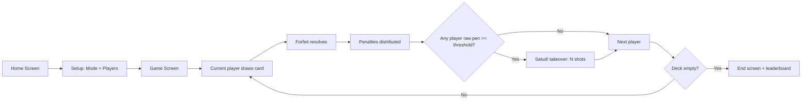
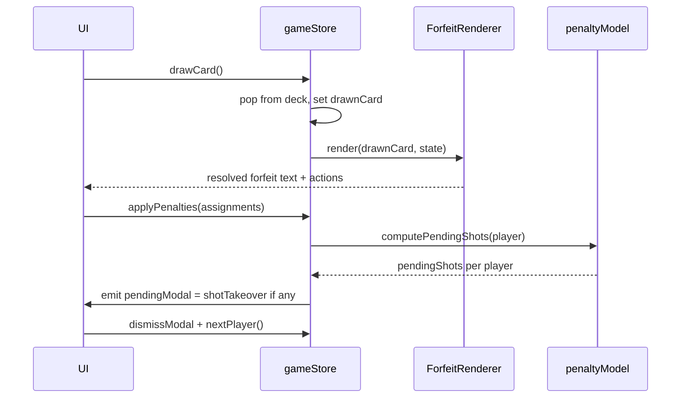

# Picante — Product Requirements Document

| Field         | Value                                                                                 |
| ------------- | ------------------------------------------------------------------------------------- |
| Version       | 1.0.0-draft                                                                           |
| Status        | Draft — accepted for implementation                                                   |
| Last updated  | 2026-04-17                                                                            |
| Owner         | @oliver                                                                               |
| Source branch | `feature/picante-prd` → `dev`                                                         |
| Scope         | v1 launch (MVP) + forward-looking architecture notes for v1.1+                        |

> This document is the **canonical** product spec for Picante. Implementation work
> derives from it. Any mechanical, content, or UX change must be proposed as a PR
> against this file on `dev`. Section IDs are stable — link to them from issues/PRs.

**Change log**

| Version        | Date        | Author   | Notes                                                            |
| -------------- | ----------- | -------- | ---------------------------------------------------------------- |
| 1.0.0-draft    | 2026-04-17  | @oliver  | Initial extraction from planning thread; authored on scaffold.   |

---

## Table of contents

1. [Vision & positioning](#1-vision--positioning)
2. [Target audience](#2-target-audience)
3. [Core game loop](#3-core-game-loop)
4. [Game mechanics](#4-game-mechanics)
5. [Game content](#5-game-content)
6. [UX & screens](#6-ux--screens)
7. [Brand & design system](#7-brand--design-system)
8. [Technical architecture](#8-technical-architecture)
9. [Monetization](#9-monetization)
10. [Legal, compliance, safety](#10-legal-compliance-safety)
11. [Analytics & success metrics](#11-analytics--success-metrics)
12. [MVP scope (v1 launch)](#12-mvp-scope-v1-launch)
13. [Open calibration items](#13-open-calibration-items-pre-content-lock)

---

## 1. Vision & positioning

**One-liner.** A messy-but-classy adult drinking game for groups of 4–16, driven by
a single host phone and a physics-first penalty economy that makes everyone drink
at a fair pace regardless of what's in their glass.

**Market positioning.** Premium party-game companion. Not a throwaway prank app.
Think _"Cards Against Humanity's taste + Ring of Fire's mechanics + a modern React
Native production."_

**Differentiators.**

- ABV-normalised penalty thresholds — lightweights and spirit-drinkers drink equal units
- Two content tiers (Tradicional / Diablo) with identical mechanics but escalating intent
- Bias-weighted random targeting — low-pen players pulled in gently; physical forfeits
  (kisses, risqué) additionally weighted by mutual attraction. No hard gating, fully
  inclusive — every candidate always carries non-zero weight
- Host-only single-device design — no accounts, no friction, works on a phone or a TV
- Expandable forfeit-pack catalogue as the monetization engine

**Emotional target.** Adults testing boundaries together. Sensual, chaotic,
stylish. Never juvenile, never cruel.

---

## 2. Target audience

- **Primary.** 21–35, social hosts, parties of 4–16, mixed company, comfortable with adult content
- **Core use-case.** Pre-drinks / house parties / hen-do / stag-do / small group game nights
- **Secondary.** Stream-to-TV group setups (hence 16:9 support), LDR couples (future "Remote Pack")

---

## 3. Core game loop



- 52-card deck, one pass, fixed rotation turn order
- Game ends when deck is empty (no reshuffle in v1)
- Expected session length: 45–90 min depending on player count
- **Core rule.** Drinking is *never* a forfeit action. Forfeits deal in penalties
  only. Shots are the exclusive consequence of `rawPenalties` crossing a player's
  threshold — never something a card can directly command.

---

## 4. Game mechanics

### 4.1 Penalty economy

Three tracked values per player (two counters + one derived):

- `rawPenalties` — monotonically increasing lifetime session penalties. Drives
  leaderboard + Ace ranking. Never decreases, never resets.
- `penaltiesSinceLastShot` — current progress toward the next shot. Displayed as
  `X` in the `X / threshold` ring. **Resets to the overflow remainder** whenever
  a shot is taken.
- `shotsTaken` — integer count of shots the player has consumed this session.

**Apply-penalties algorithm** (runs every time a player accrues `n` penalties):

```
player.rawPenalties += n
player.penaltiesSinceLastShot += n
pendingShots = floor(player.penaltiesSinceLastShot / player.threshold)
if pendingShots > 0:
    player.shotsTaken += pendingShots
    player.penaltiesSinceLastShot = player.penaltiesSinceLastShot % player.threshold
    trigger shotTakeover(player, pendingShots)
```

**Why split from the modulo model.** Resilient to mid-game threshold changes
(§4.8). `rawPenalties` stays untouched as the lifetime truth,
`penaltiesSinceLastShot` always reflects *current* progress toward the *current*
threshold, and no retroactive recomputation is needed when `abv` or `difficulty`
is edited mid-session.

**Multi-shot batching.** A single forfeit can push `pendingShots` ≥ 2 in one
step; the shot takeover renders a single "TAKE N SHOTS" message with one `Salud!`
group-cheers prompt, then advances the turn.

### 4.2 Threshold formula

Threshold is derived per-player from `(abv, numPlayers, difficulty)`:

```
threshold = max(1, round(abvCoefficient(abv, numPlayers) × difficultyMultiplier))
```

Difficulty multipliers: `Passive = 1.5×`, `Tradicional = 1.0×`, `Muerte = 0.5×`.

ABV buckets (per player count) extend the original spec's `<20 / 20–30 / 30–40 /
>40` table with `<5 / 5–10 / 10–20` granularity for beers, ciders, RTDs. The
lookup table lives in `src/game/penaltyModel.ts` — calibrated against the
Fin/Con/Clara/Harley/Clegg reference examples at 5 players and extrapolated to
4 and 6–16.

### 4.3 The four Aces (rubber-band / punishment cards)

Ace effects rank players by `rawPenalties` (cumulative session total — punishes
cowards and the too-sober equally). The drawer **always** takes an additional
5 penalties on top of any effect, even if they are included in the targeted group.

Suit-bound mapping:

- **Ace ♠ (Sorbo)** — 3 players with the **lowest** `rawPenalties` take `15 / 10 / 5`
  penalties respectively. _"The sober catch up."_ Drawer +5.
- **Ace ♥ (Secretos)** — 3 players with the **highest** `rawPenalties` take
  `15 / 10 / 5` penalties. _"The loudest get louder."_ Drawer +5.
- **Ace ♦ (Riesgos)** — Single lowest `rawPenalties` player takes
  `floor((highest − lowest) / 2)` penalties. _"Risk equalises."_ Drawer +5.
- **Ace ♣ (Locura)** — Single highest `rawPenalties` player takes
  `floor((highest − lowest) / 2)` penalties. _"Chaos snowballs."_ Drawer +5.

### 4.4 Suits

**Standardised card values** (penalty units at stake) — applied universally across
all four suits:

| Card      | Penalty          |
| --------- | ---------------- |
| 2–10      | card face value  |
| J         | 10               |
| Q         | 10               |
| K         | 15               |
| A         | effect-defined (§4.3) |

The table below defines the *forfeit type* per suit × card — the penalty *amount*
is always the value above, never re-specified per card.

| Suit       | Spanish   | Theme           | Numbered (2–10)                                                                                                                       | J                                                                                                                    | Q                                                                                                                                                           | K                                                                                                      |
| ---------- | --------- | --------------- | ------------------------------------------------------------------------------------------------------------------------------------- | -------------------------------------------------------------------------------------------------------------------- | ----------------------------------------------------------------------------------------------------------------------------------------------------------- | ------------------------------------------------------------------------------------------------------ |
| ♥ Hearts   | Secretos  | Truths (self)   | A random other player *(bias-weighted, any)* asks you a truth (not yes/no). Answer → they take penalty. Cop-out → you take it.       | True/false statement about yourself; distribute penalty among wrong-guessers (take it if *everyone* was correct).    | Reveal a spicy secret about yourself; if news to everyone, distribute the penalty; if not, you take it.                                                     | A random other player *(bias-weighted, any)* asks a darker / more intimate truth. Same resolution as numbered. |
| ♦ Diamonds | Riesgos   | Dares           | A random other player *(bias-weighted, any)* dares you. Do it → they take penalty. Cop-out → you take it.                            | Dare a random other player *(§4.6.a bias-weighted)*. Do it → they take penalty. Cop-out → you take it.               | Send a risqué message to a random other player *(bias-weighted, `physical`)*. Send → they take penalty. Cop-out → you take it.                              | A random other player *(bias-weighted, any)* gives a significantly harder dare. Same resolution, higher stakes. |
| ♠ Spades   | Sorbo     | Shared pain     | "Who is the most X?" group vote. **Split the penalty**: drawer auto-takes `ceil(N/2)`, chosen most-voted player takes `floor(N/2)`. | Pick a random other player *(bias-weighted, any)*. You both take the penalty.                                         | A random other player *(bias-weighted, `physical`)* is invited to a kiss with the drawer. Both kiss → distribute penalty among the rest. Both decline → each takes half (rounded up). One declines → they take all. | Pick a random other player *(bias-weighted, any)*. You both take the penalty.                           |
| ♣ Clubs    | Locura    | Mini-games      | Each of 2–10 is a canned mini-game (§4.4.a). Loser takes the penalty.                                                                | **Drawer's Challenge** — drawer invents a short physical / trivia / dexterity challenge and picks any player to attempt it. Complete → drawer takes penalty. Fail → they take penalty. | **1v1 Rock-Paper-Scissors** — drawer picks any player. One round RPS. Loser takes the penalty.                                                              | **Picante Roulette** — on "3", every player (including drawer) simultaneously points at one other. Most-pointed-at takes penalty; ties broken by drawer. |

Notes on the rewrites:

- **No "drink N" wording anywhere.** Everything phrased as penalties; drinking
  only arises from threshold crossings.
- **Physical forfeits (kisses, risqué messages) use attraction-weighted random
  targeting** (§4.6.a), not free choice or hard gating. In a hetero group this
  overwhelmingly surfaces cross-sex targets; in a queer group it surfaces matched-
  orientation targets; in a mixed group both. Cop-out remains for both drawer and
  recipient.
- **Clubs J/Q/K are each unique mini-games** — Drawer's Challenge (1v1 creative),
  Rock-Paper-Scissors (1v1 binary), Picante Roulette (group chaos). Each distinct
  in shape from the numbered mini-games and from each other.

### 4.4.a Numbered Clubs mini-games (one per card value, canned)

- **2 — Index:** first to *not* touch their index finger to their nose loses.
- **3 — Three-word:** build a sentence one word at a time around the table; break = lose.
- **4 — Categories:** pick a category, go round naming items, repeat/blank = lose.
- **5 — Thumb war:** drawer picks a challenger; loser takes pen.
- **6 — Countdown:** drawer counts to 10 in their head; last to shout "stop" at the moment they think is 10s loses.
- **7 — Rhyme chain:** drawer says a word, each player rhymes in sequence; break = lose.
- **8 — Staring:** drawer picks a challenger; first to blink/laugh loses.
- **9 — Odds:** drawer challenges a player "what are the odds you'll X?"; 3–2–1 say a number in range; match = challenged does it or takes pen.
- **10 — Most-likely vote:** "who is most likely to X?" group vote; most-voted takes pen.

These can be iterated in content review.

### 4.5 Cop-out mechanic

There is no separate cop-out button. Every forfeit's text encodes its own escape —
the "cop-out" is the penalty cost for refusing, always defined inline. The drawer
simply chooses: perform the forfeit action, or take the penalty cost as written
on the card.

### 4.6 Penalty distribution UX

When a forfeit says "distribute N penalties," the app presents a tap-to-assign
modal: list of players with `+` / `−` buttons, a running total, and a `Confirm`
button disabled until `allocated === N`.

### 4.6.a Random-target selection (bias-weighted)

Every forfeit token that resolves to "a random other player" runs through the same
sampler with two composable weight factors:

```
weight(candidate) = lowPenWeight(candidate) × attractionWeight(drawer, candidate, mode)

lowPenWeight(c)    = (maxRaw - c.rawPenalties) + 1
maxRaw             = max(rawPenalties across non-drawer candidates)
```

`lowPenWeight` always applies — it gently pulls disengaged players into the action.
Guarantees non-zero weight for the leaderboard leader.

`attractionWeight` depends on the forfeit's declared targeting mode (set per
`ForfeitTemplate`):

```
attractionWeight(d, c, mode):
    if mode === 'any': return 1.0                       // non-physical forfeits
    if mode === 'physical':
        drawerInto    = d.attractedTo.includes(c.gender)
        candidateInto = c.attractedTo.includes(d.gender)
        if drawerInto && candidateInto: return 3.0      // mutual attraction
        if drawerInto || candidateInto: return 1.0      // one-sided
        return 0.3                                      // neither (still non-zero — cop-out exists)
```

Final sample proportional to total weight. All weights configurable in
`penaltyModel.ts` for post-launch tuning.

**Why these numbers.** The `3.0 / 1.0 / 0.3` spread produces sensible behaviour
across group compositions:

- All-hetero group of 4 (2M + 2F): physical forfeits overwhelmingly target the
  two opposite-sex players with mutual attraction; same-sex players still eligible
  but rare.
- All-male gay group: physical forfeits target mutually-attracted pairs; any
  straight friend in the group is rare but possible.
- Mixed queer group: natural mutual-attraction weighting emerges without the
  app imposing any structure.

**Targeting mode is per-forfeit, not per-suit.** Q♠ (kiss) is `physical`,
Q♦ (risqué message) is `physical`, J♦ (dare a random player) is `any`,
J♠ (shared penalty pick) is `any`. Mode is declared on each `ForfeitTemplate` in
the content pack JSON so it's trivially tunable without code changes.

### 4.7 Shot takeover

On any turn where at least one player's `rawPenalties` crosses a threshold multiple:

1. Full-screen takeover with player's name.
2. `TAKE N SHOTS` callout (batched count of all pending shots).
3. "Salud!" group-cheers prompt (tap to dismiss).
4. `shotsTaken[player]` advances by `N`, `penaltiesSinceLastShot` is reduced to
   its overflow remainder, takeover dismisses, turn continues.

### 4.8 Mid-game roster & player adjustments

The Game screen exposes a subtle settings affordance (top-right gear) that opens
a roster-editor overlay. From here the host can:

**Edit existing players** (`name`, `abv%`, `difficulty`, `gender`, `attractedTo`):

- `threshold` is recalculated immediately from `(abv, difficulty, numPlayers)`.
- `rawPenalties` / `shotsTaken` are **preserved untouched** — history is sacred.
- `penaltiesSinceLastShot` preserved as-is but interpreted against new threshold.
  If new threshold < current `penaltiesSinceLastShot`, the apply-penalty algorithm
  triggers on the next mutation and the player takes any back-owed shot(s).

**Add a new player**:

- Inserted into the turn order after the current player.
- All counters start at 0.
- `numPlayers` increments. **Every existing player's threshold is recalculated**
  against the new `numPlayers` (generally reducing thresholds slightly, tightening
  the game). `rawPenalties` / `penaltiesSinceLastShot` / `shotsTaken` preserved.
  Back-owed-shot logic runs for any player whose
  `penaltiesSinceLastShot >= newThreshold`.

**Remove a player**:

- If it's currently their turn, skip forward.
- Their `rawPenalties` / `shotsTaken` preserved in a `removedPlayers` ledger for
  end-game leaderboard completeness (marked "left").
- Pending-but-unconsumed shots are simply lost.
- `numPlayers` decrements. Every remaining player's threshold is recalculated
  (generally raising thresholds). Back-owed-shot logic does *not* trigger on
  threshold *increase*.

**Deck behaviour.** Untouched by roster changes. Already-drawn cards stay drawn;
remaining cards continue in their existing order. More players → shorter overall
game; fewer players → longer.

**Ace ranking** is computed dynamically at the moment of draw, so it automatically
reflects the current roster — no special handling needed.

---

## 5. Game content

### 5.1 Rules for forfeits (content invariants)

These are **hard invariants** every forfeit in every pack must satisfy. They're
enforceable in `packLoader.ts` validation where mechanical, and enforced by
content review where subjective.

1. **Forfeits are guidelines, not scripts.** Text provides the *floor* — a
   direction and (for higher-value cards) a difficulty assertion — but never
   dictates an exact action. The group decides the specifics. Spicier modes
   (Diablo+) may raise the floor's intensity, but must still delegate the
   concrete action to the group. Mini-games (Clubs 2–Q) are an explicit
   exception: the mini-game *is* the forfeit, so its structure is fixed.
2. **Every card allocates at least one penalty.** No card may resolve with
   zero penalties applied. "Everyone off free" is not a legal branch. Design
   a forfeit so at least one named path always ends in penalty allocation.
3. **No multi-turn forfeits.** A card's effect must resolve entirely within
   its own turn. The *only* exception is strictly passive states that require
   zero ongoing thought from the player (e.g., "lose a layer of clothes until
   end of game"). Active obligations that span turns (thumb-master, rule-master,
   sentries) are forbidden.
4. **Low-friction floor.** Forfeit guidelines must not mandate long-duration
   actions or significant physical movement. The group can escalate voluntarily;
   the card must not. Assume hosts are playing in confined social spaces.
5. **Always a cop-out.** No player is ever forced to perform a forfeit. Every
   non-automatic card must provide an explicit "cop-out → player takes the
   penalty" branch. The cop-out is the safety valve that keeps participation
   consent-based.
6. **Forfeits never command drinking.** Drinking is the exclusive consequence
   of `rawPenalties` crossing a threshold (§4.7). No forfeit may instruct
   anyone to take a sip, a shot, or any other drink as part of its action.
   Drinking is earned, not assigned.
7. **Fixed penalty-by-rank.** Every card's total distributed penalty equals
   its rank value:
   - **2–10** → penalty equals the card's numeric value.
   - **J, Q** → penalty is 10.
   - **K** → penalty is 15.
   - **A** → governed by the Ace-specific mechanic (§4.3); exempt from this
     rule.

   "Total distributed" means the sum of penalties applied across all affected
   players in any branch. A card that splits or double-hits still sums to its
   rank value.

### 5.2 Modes

- **Tradicional (free).** Baseline forfeits, flirtatious not explicit, aligns
  with the current forfeit wording.
- **Diablo (paid unlock, $4.99 one-time).** Identical mechanics, content pool
  swapped for noticeably spicier, more sexual, more confrontational forfeit
  language. Same card structure, same economy.

### 5.3 Forfeit content architecture

Pack-based JSON, designed to be hot-swappable so v2 can ship remote packs without
refactoring:

```
src/content/
    packs/
        tradicional.json        # v1 shipped
        diablo.json             # v1 shipped (paid unlock)
        future-pack.json        # future catalogue
    packLoader.ts
```

Each forfeit entry:

```ts
type ForfeitTemplate = {
    suit: 'hearts' | 'diamonds' | 'spades' | 'clubs';
    value: 2 | 3 | 4 | 5 | 6 | 7 | 8 | 9 | 10 | 'J' | 'Q' | 'K' | 'A';
    text: string;              // supports {{drawer}}, {{biasedRandom}} tokens
    penalty: 'cardValue' | 'cardValueHalf' | number;  // usually derived from value per §4.4
    targetingMode: 'any' | 'physical';   // drives §4.6.a attractionWeight; defaults to 'any'
    miniGame?: MiniGameId;     // clubs numbered only
};
```

At runtime, token substitution is done by `ForfeitRenderer` given the current
`GameState`.

### 5.4 Pack catalogue roadmap

- v1: Tradicional (free), Diablo ($4.99)
- v2+: Couples Pack, Bachelorette Pack, Pride Pack, Cursed Christmas, Stag-Do
  Pack, Remote/LDR Pack — each $1.99–2.99

---

## 6. UX & screens

No scrolling on any game-critical screen. All content fits both 9:16 (portrait
mobile) and 16:9 (landscape / TV-streamed).

### 6.1 Screen inventory

- **Home** — big `START GAME` CTA, `How to Play`, settings gear. That's it.
- **Setup (3 steps, paginated)**
    1. Mode select: Tradicional / Diablo (locked if not purchased).
    2. Player roster: 4–16 players. Per player: `name`, `abv%` (numeric input
       with common presets — beer 5%, wine 12%, spirits 40%), `difficulty`
       (Passive / Tradicional / Muerte), `gender` (Man / Woman / Non-binary),
       `attractedTo` (multiselect; empty = asexual / opt-out of physical
       targeting). The attraction fields only influence the `physical` targeting
       mode (§4.6.a); they do not gate any forfeit.
    3. Review & begin: shows each player's computed threshold so hosts can sanity-check.
- **Game** — primary gameplay screen (layout in §6.2).
- **Shot Takeover** — overlay modal.
- **Penalty Distribution** — overlay modal.
- **Mid-game Roster Editor** — overlay modal (§4.8).
- **End Screen** — final leaderboard (sorted by `rawPenalties` desc), shot counts,
  "most X" fun awards, `Play Again` / `Home`.
- **Resume Prompt** — shown on app launch if a session is mid-flight (from auto-save).

### 6.2 Game screen layout (9:16)

- **Header.** Current player's name (huge, display serif), avatar/initial,
  `X/Y` threshold ring.
- **Middle (hero area).** Drawn card art + suit icon + forfeit text. Card-value
  and suit dictate content. Below the text, contextual actions
  (`Distribute Penalties`, `Next Turn`, etc.).
- **Footer (two elements).**
    - Left: cards-remaining-in-deck counter (progress bar).
    - Right: top-3 players closest to next shot (ranked by
      `penaltiesSinceLastShot / threshold`) with small threshold rings.
- Full roster (up to 16 players) is not in the footer — accessed via the
  top-right gear menu. Top-3 ticker remains the at-a-glance tension indicator
  regardless of group size.

### 6.3 Game screen layout (16:9)

Same three zones rebalanced horizontally: left column = current player + footer
stack, right column = hero forfeit area. Optimised for TV streaming where the
host's phone drives the display.

### 6.4 Auto-resume

Session state persisted to `AsyncStorage` on every state mutation. On app launch,
if a live session exists, show a `Resume previous game?` prompt before home.

### 6.5 Input patterns for subjective outcomes

The app is host-driven and single-device, so every subjective decision routes
through the drawer's phone.

**"Who is the most X?" voting** (Spades numbered + any future vote-style forfeit):

1. Forfeit text displays with a `Start Vote` button.
2. Tapping it launches a 3 → 2 → 1 countdown with the prompt "POINT!".
3. On "POINT!", the in-room players point at their chosen target IRL.
4. The phone then shows a player grid; the drawer taps the most-pointed-at avatar.
5. Ties: drawer taps any one of the tied candidates (flagged as a tie in history).

**Adjudication for subjective forfeits** ("did they answer?", "did they complete
the dare?", "did they send the message?"):

- Two-button confirm: **"Yes, done"** / **"No, cop-out"**, large thumb targets,
  suit-coloured.
- Drawer taps the outcome on behalf of the group. Rationale: host-rotated game,
  the judged player has the cop-out lever inline, group consensus is fast.
- History log captures the outcome for end-game awards.

---

## 7. Brand & design system

### 7.1 Typography

- **Display / header.** Fraunces (variable serif, `opsz` cranked for headlines,
  `SOFT` + `wonk` for personality). Used for logo wordmark, player names, card
  values, mode titles.
- **Body / UI.** Inter (neutral, ultra-legible, free). Used for forfeit text,
  buttons, labels.

### 7.2 Colour system

Dark-first, single theme (dark mode only in v1).

- **Base / background.** Near-black `#0A0A0A`, off-black panels `#141414`,
  subtle borders `#262626`.
- **Brand accents.**
    - `picante-orange` `#FF6B35` — primary CTA, Tradicional suit accents, Diamonds
    - `picante-yellow` `#F5C518` — highlights, shot-takeover, Clubs
    - `picante-purple` `#8B3FBF` — Diablo mode, Spades
    - `picante-green`  `#3FAE6A` — success states, confirmations, Hearts
- **Text.** `#F5F5F5` primary, `#A3A3A3` secondary, `#525252` tertiary.
- **Usage principle.** Single-accent-per-context — suit accents during their card,
  neutral elsewhere. Gradients reserved for shot takeovers and mode-select hero
  buttons.

### 7.3 Iconography

All suit symbols, card faces, and decorative flourishes delivered as SVG
components in `/src/ui/svg/`. React Native SVG. No raster assets except for
photographic brand moments.

### 7.4 Motion

- Card flip on draw (Reanimated, spring).
- Gradient pulse on shot takeover.
- Number tick animation for threshold progress.
- Subtle haptic taps on iOS (light for actions, medium for shot trigger); Android
  haptics as a later addition via `expo-haptics`.

### 7.5 Sound (minimal v1)

Four licensed SFX samples, no music in v1. All toggleable from a single Settings
switch, default on.

- `card_flip` — short shuffle/flip on every card draw.
- `salud_chime` — celebratory rising-tone hit under the shot takeover's "Salud!" prompt.
- `ace_sting` — 1-second dramatic sting when an Ace is drawn (before the effect resolves).
- `vote_countdown` — a light tick-tick-tick under the 3-2-1 voting countdown.

Sourced from a CC0 / royalty-free library. Files under 50KB each, lazy-loaded
through `expo-av`.

Music deferred to a v1.1 "Vibes" update once core playtesting validates the
minimum-viable audio scope.

### 7.6 Visual identity production

All brand visuals generated programmatically from SVG in v1 — zero external asset
handoffs, zero PNG rasters in the bundle (except the final platform-required app
icon export which is rendered from an SVG source at build time).

- **Wordmark.** "Picante" typeset in Fraunces display with `opsz` maxed and
  `SOFT` + `wonk` axes tuned for personality, rendered inline as SVG in
  `src/ui/svg/Wordmark.tsx`.
- **Suit icons.** Custom Picante variants of ♥ ♦ ♠ ♣ with subtle asymmetry and
  brand-coloured accents, also SVG components.
- **Card faces.** SVG-composed card templates; J/Q/K use iconic figure
  illustrations built as SVG paths rather than standard playing-card art. Card
  back uses a suit-agnostic gradient pattern.
- **App icon.** Gradient-based SVG composition → exported to required platform
  sizes at build time via `expo-build-properties` / `app.json` `icon` field.
- **Splash screen.** Same gradient as app icon with animated wordmark reveal.

---

## 8. Technical architecture

### 8.1 Stack

- **Runtime.** Expo SDK (latest stable), React Native universal.
- **Language.** TypeScript, strict mode.
- **State.** Zustand (one store: `gameStore`, selectors per screen).
- **Animations.** React Native Reanimated 3 + Moti for declarative use.
- **SVG.** `react-native-svg`.
- **Audio.** `expo-av` for the 4 SFX samples (§7.5).
- **Persistence.** `@react-native-async-storage/async-storage` (session snapshot
  + purchased packs).
- **Payments.** `react-native-iap` (iOS StoreKit, Android Billing), stub on web.
- **Fonts.** `expo-font` loading Fraunces + Inter.
- **i18n.** All user-facing strings routed through a lightweight `src/i18n/en.ts`
  module from day 1 — cheap insurance for future localization, zero retrofit cost.
  v1 ships English only.
- **Platforms.** iOS + Android + Web (Expo's Metro web target).
- **Bundle identifier.** `com.picante.placeholder` for the build, swapped to a
  final reverse-DNS string before first store submission.

### 8.2 Project structure (compository root)

```
picante/
    app/                       # screens (expo-router)
        (home)/index.tsx
        setup/mode.tsx
        setup/players.tsx
        setup/review.tsx
        game/index.tsx
        end/index.tsx
    src/
        game/                  # pure game logic (no RN imports)
            penaltyModel.ts    # threshold formula, shot math
            deck.ts            # deck building, draw, no-reshuffle
            forfeitRenderer.ts # token substitution
            aces.ts            # ace effect resolvers
            targeting.ts       # bias-weighted sampler
            gameStore.ts       # zustand store
            persistence.ts     # async-storage adapter
        content/
            packs/*.json
            packLoader.ts
        ui/
            components/        # Button, PlayerChip, ThresholdRing, CardArt, etc.
            svg/               # all svgs
            theme.ts           # colours, spacing, radii, typography tokens
        platform/
            iap.ts             # facade over react-native-iap + web stub
            haptics.ts
        i18n/
            en.ts
    docs/
        PRD.md
```

Max ~100 lines per file — components split aggressively. Pure game logic
(`/src/game/`) unit-tested in isolation with no RN dependency.

### 8.3 State shape (abridged)

```ts
type GameState = {
    mode: 'tradicional' | 'diablo';
    players: Player[];                 // turn order (index-based rotation)
    currentPlayerIndex: number;
    deck: Card[];                      // remaining, in draw order
    drawnCard: Card | null;
    history: TurnRecord[];             // end-game leaderboard + debugging
    pendingModal: ModalRequest | null; // distribute / shot-takeover / etc
};

type Gender = 'man' | 'woman' | 'nonbinary';

type Player = {
    id: string;
    name: string;
    abv: number;                       // 0..1 (e.g. 0.4 = 40% ABV)
    difficulty: 'passive' | 'tradicional' | 'muerte';
    gender: Gender;                    // drives physical-forfeit attraction weighting (§4.6.a)
    attractedTo: Gender[];             // multiselect; empty = opt-out of physical targeting
    rawPenalties: number;              // lifetime, leaderboard, Ace ranking
    penaltiesSinceLastShot: number;    // displayed as X/threshold; resets to overflow on shot
    shotsTaken: number;
    threshold: number;                 // recomputed on any mid-game roster change (§4.8)
    status: 'active' | 'removed';      // removed players stay in history for leaderboard
};
```

### 8.4 Data flow for a turn



---

## 9. Monetization

### 9.1 v1 model

- **Tradicional mode.** Free forever, full experience.
- **Diablo mode.** $4.99 one-time IAP, platform-native (StoreKit / Play Billing).
- **No ads, no subscription, no dark patterns.**
- **Web.** Diablo unlock behind a Stripe Checkout fallback when we ship a real
  web payment flow — v1 web can launch Tradicional-only.

### 9.2 v2+ catalogue (roadmap)

Themed packs at $1.99–2.99 each, each a full 52-card content swap OR additive
"card-type" packs:

- Couples Pack, Bachelorette Pack, Pride Pack, Cursed Christmas, Stag-Do,
  Remote/LDR, Icebreaker (workplace-safe stretch?)

### 9.3 Long-tail

Merchandise extension once brand is established: branded deck, shot glasses,
"Picante Host Kit". Out of scope for v1, mentioned for PRD completeness.

### 9.4 Projected economics (speculative — flagged)

- TAM: adult party-game apps is a ~$50–100M global niche.
- Conservative: 10k downloads / year × 20% Diablo conversion × $4.99 =
  ≈ $9.98k/yr base.
- With catalogue at scale (5 packs, 15% cross-purchase): ≈ $20–30k/yr.
- This is a lifestyle project, not a unicorn. Monetization aims for "buys the
  host a nice night out every month," not VC returns.

---

## 10. Legal, compliance, safety

- **Age gate.** Hard 18+ modal on first launch (date picker or simple
  confirmation — App Store prefers the former). Stored locally, re-prompted on
  OS major version change.
- **Disclaimer.** ToS + "please drink responsibly" modal on first game start
  (per session). Static copy, linked from Settings.
- **App Store risk.** Apple has historically rejected drinking apps citing
  guidelines around encouraging alcohol consumption. **Flagged risk**: we may
  need to add unit-tracking / safety modals to clear review. Architect
  `session.ts` to accept safety hooks as a drop-in for v1.1 if rejected.
- **Content risk.** The risqué-picture and kiss forfeits need carefully worded
  framing so the app is describing, not mandating. Every spicy forfeit must
  explicitly include the cop-out path in its text.
- **Data.** Zero PII collection in v1. No accounts, no analytics network,
  everything local. This dramatically simplifies GDPR / CCPA posture to "we
  don't collect anything."

---

## 11. Analytics & success metrics

**v1 is analytics-free** (privacy-first, keeps review simple). Track
qualitatively via TestFlight/beta feedback only.

**Success criteria for v1 launch.**

- 4.5+ star average across iOS + Play.
- <2% crash rate.
- 1k downloads in first 3 months organically / via personal network.
- 15%+ Diablo conversion rate.

**v2 may introduce opt-in anonymous analytics** (PostHog self-hosted or similar)
strictly around funnel + crash, no content logging.

---

## 12. MVP scope (v1 launch)

**In.**

- Home, Setup (3 steps), Game, Shot Takeover, Distribute, Mid-game Roster Editor,
  End, Resume Prompt screens.
- Full Tradicional forfeit library (~30 distinct templates, token-substituted
  across 52 cards).
- Full Diablo forfeit library (same structure, spicier pool) as paid unlock.
- Threshold calibration lookup table with Passive/Tradicional/Muerte difficulties.
- Bias-weighted sampler with low-pen × attraction factors (§4.6.a).
- Ace effects (all 4 suit-bound).
- Clubs mini-games library (12 total: 9 numbered + 3 face cards).
- Voting + adjudication UX patterns (§6.5).
- Mid-game roster edit / add / remove with dynamic threshold recalculation (§4.8).
- Auto-resume.
- Dark-mode-only theme with Fraunces/Inter, 4-colour accent system.
- Programmatic SVG-based visual identity (wordmark, suit icons, card faces, app icon).
- Minimal SFX (4 samples, toggleable).
- i18n scaffolding (English v1).
- Expo universal (iOS + Android + Web).
- Diablo IAP on iOS + Android; restore purchases; web launches Tradicional-only.
- 18+ gate, ToS/disclaimer modal, placeholder bundle ID.

**Out (post-v1 roadmap).**

- Additional content packs.
- Accounts / cloud save.
- Stats / history / profile memory.
- Remote-play mode.
- Safety features (unit tracking, water rounds, safe word).
- Light theme.
- Analytics.
- Localization (English-only v1; copy sprinkled with Spanish suit names as flavour).
- Merch.

---

## 13. Open calibration items (pre-content-lock)

1. **Threshold lookup table** — derive ABV-granular buckets (including sub-20%
   for beers/ciders) that fit the `Fin (4% → 1)`, `Con (20% → 6)`,
   `Clara (20% Passive → 9)`, `Harley (37.5% → 12)`, `Clegg (15% Muerte → 3)`
   examples at 5 players, then extrapolate for 4 and 6–16 player counts.
   Spreadsheet-driven, user signs off before content is written.
2. **Difficulty multipliers** — the `1.5 / 1.0 / 0.5` proposal for Passive /
   Tradicional / Muerte may need tuning based on playtested session-length targets.
3. **Low-pen bias curve** — linear `(maxRaw − playerRaw) + 1` is the v1 default.
   Too subtle → exponentiate (`weight^2`). Too aggressive → add a flat floor.
   Playtest-driven.
4. **Attraction weight magnitudes** — the `3.0 / 1.0 / 0.3` (mutual / one-sided /
   neither) spread may need tuning. Groups with no mutual pairings should still
   generate acceptable physical-forfeit targeting — verify in playtest.
5. **Clubs mini-games (2–10)** — the canned list is a first pass; some (like
   Countdown/Odds) may be fiddly in practice and need replacing.
6. **Clubs J/Q/K mini-games** — Drawer's Challenge / RPS / Picante Roulette are
   a first-pass design; playtest for flow, specifically whether Drawer's Challenge
   is too open-ended.
7. **Forfeit copy tone audit** — once drafts exist, pass through together to align
   voice on "messy but classy" without drifting into either crude or corporate.
8. **Risqué forfeit wording** — needs careful framing (invitation + explicit
   cop-out, never mandate) for App Store review. Draft, review, iterate.
9. **Diablo mode delta magnitude** — confirm whether Diablo diverges only in
   *content wording* (current plan) or additionally in *intensity of consequences*.
   Round 2 decision: content-only — revisit once drafts exist.
